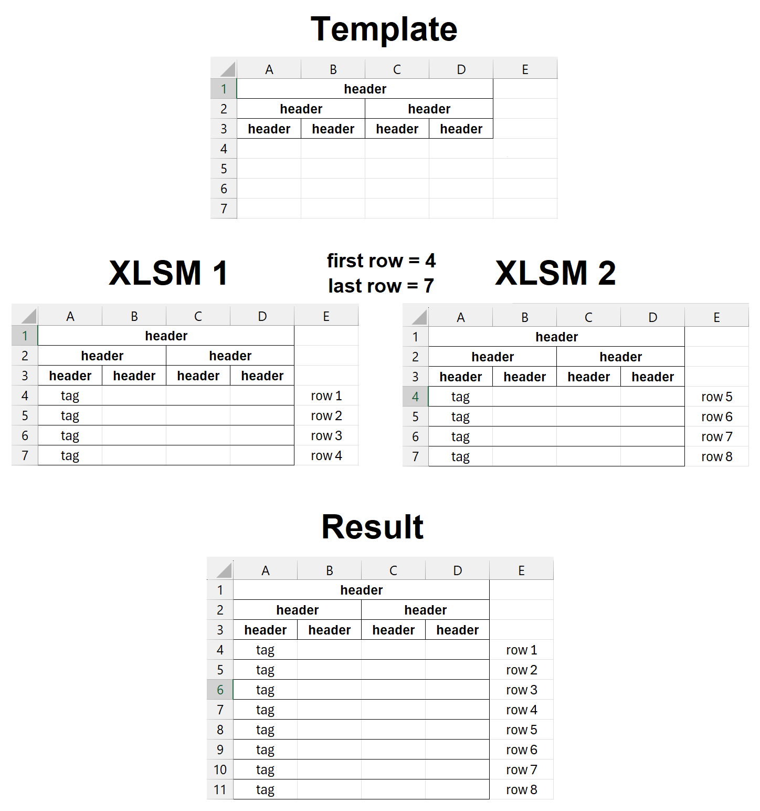

# MergeXLSM

#### A tool to merge XLSM files with the same headers written in C#

### How does it work?
You put the template file (containing only headers) and other XLSM files in the same directory and specify the range of lines that need to be merged. The program processes each file by copying lines from "first row" to "last row" (inclusive) into a template file, then saves the result to a separate file.

### Requirements
- Windows, Linux or macOS (x64 versions only)
- [.NET Runtime 8.0](https://dotnet.microsoft.com/en-us/download/dotnet/8.0)
- [ClosedXML](https://github.com/ClosedXML/ClosedXML) (<ins>already included</ins> in the project as a dependency)
- Any office suite that supports XLSM format

### Usage
MergeXLSM.exe -i *template.xlsm* -o *result.xlsm* -dir *directory* -first *number* -last *number* -tag *text*

**Arguments:**

* -i *file*     
  Template XLSM file (default: Template.xlsm)
* -o *file*     
  Output XLSM file (default: Result.xlsm)
* -dir *path*   
  Directory containing XLSM files (default: XLSM)
* -first *num*  
  First row to process (default: 6)
* -last *num*   
  Last row to process (default: 1000)
* -tag *text*   
  Tag to search for in the first column (default: Fact)

### Example

  MergeXLSM.exe -i Template.xlsm -o Result.xlsm -dir XLSM -first 4 -last 7 -tag tag

<picture>
	
</picture>